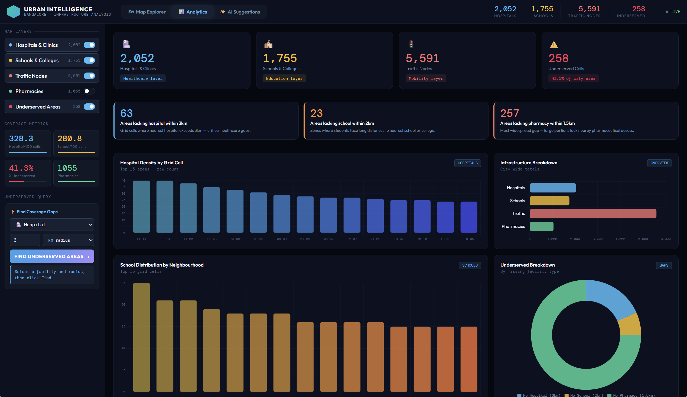
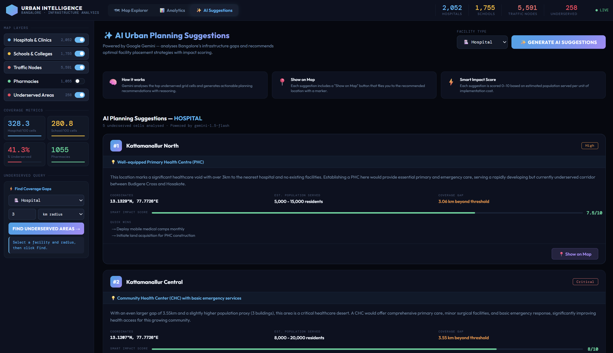

<div align="center">

# 🏙️ Urban Intelligence Dashboard

### AI-Powered Infrastructure Analysis for Bangalore City

[](https://fastapi.tiangolo.com)
[](https://python.org)
[](https://leafletjs.com)
[](https://aistudio.google.com)
[](https://vercel.com)
[](https://render.com)
[](https://openstreetmap.org)

<br/>

**An interactive full-stack web application that visualises urban infrastructure density, detects underserved areas, and generates AI-powered planning recommendations for Bangalore using real OpenStreetMap data.**

<br/>

🌐 **[Live Demo](https://urban-intelligence-dashboard-seven.vercel.app/)** &nbsp;|&nbsp; 📡 **[API Docs](https://urban-intelligence-dashboard.onrender.com/docs)** &nbsp;|&nbsp; 📊 **[API Health](https://urban-intelligence-dashboard.onrender.com/api/v1/health)**

<br/>


</div>

---

## 📌 Problem Statement

City infrastructure data is fragmented and difficult to interpret at scale. Planners and analysts lack unified tools to understand how hospitals, schools, and pharmacies are distributed across different neighbourhoods — or more critically, where they are **absent**.

This dashboard addresses a core urban planning question:

> **"Which areas in Bangalore lack sufficient access to hospitals, schools, and pharmacies — and where should new facilities be built?"**

By collecting, processing, and visualising 233,000+ real infrastructure data points, the dashboard enables planners to identify underserved zones, analyse density patterns, and receive AI-generated facility placement recommendations — all in one place.

---

## ✨ Key Features

| Feature | Description |
|---------|-------------|
| 🌌 **OLED Dark Aesthetic** | Premium dark mode with Glassmorphism floating panels & neon accents |
| 🗺️ **CartoDB DarkMatter Map** | Interactive Leaflet spatial explorer with smooth `flyTo` transitions |
| 🔥 **Organic Heatmaps** | Square grids deprecated in favour of smooth, dynamic gradient Heatmaps |
| 📊 **Advanced Telemetry Hub** | Chart.js integrations: Radar (Readiness), Multi-Axis (Trajectory), Doughnut (Efficiency) |
| 🤖 **Cyberpunk AI Strategist** | Gemini 1.5 powers a terminal-style neural scanner with glowing ROI matrices |
| 📍 **Vector Targeting** | AI suggestions link directly back to the map with pulsing neon locators |
| 🔌 **REST API** | Fully versioned FastAPI backend with interactive Swagger documentation |
| 🌐 **Fully Deployed** | Live on Vercel (frontend) + Render (backend) — no local setup required |

---

## 🏗️ Project Architecture

```
urban-intelligence-dashboard/
│
├── backend/
│   ├── data_collection/
│   │   └── fetch_osm_data.py       # Pulls data from OpenStreetMap Overpass API
│   │                               # Smart retry + resume logic, 5 categories
│   │
│   ├── data_processing/
│   │   └── process_data.py         # Cleans, grids city, computes density
│   │                               # Haversine-based underserved detection
│   │
│   ├── data/
│   │   ├── blr_hospitals.json      # Raw OSM data (gitignored, regeneratable)
│   │   ├── blr_schools.json
│   │   ├── blr_traffic_nodes.json
│   │   ├── blr_buildings.json
│   │   ├── blr_pharmacies.json
│   │   └── processed/              # Cleaned + analysed outputs (gitignored)
│   │       ├── hospitals_clean.json
│   │       ├── schools_clean.json
│   │       ├── traffic_nodes_clean.json
│   │       ├── buildings_clean.json
│   │       ├── pharmacies_clean.json
│   │       ├── grid_analysis.json
│   │       ├── underserved_areas.json
│   │       └── city_stats.json
│   │
│   ├── app.py                      # FastAPI — 8 versioned REST endpoints
│   ├── requirements.txt
│   └── .env.example
│
├── frontend/
│   ├── index.html                  # Clean HTML structure (3 tab views)
│   ├── css/
│   │   └── styles.css              # All styling + CSS design tokens
│   ├── js/
│   │   ├── config.js               # API URL, colours, city bounds, app state
│   │   ├── map.js                  # Leaflet map, layers, markers, popups
│   │   ├── sidebar.js              # KPI cards, coverage metrics, view switching
│   │   ├── query.js                # Dynamic underserved area query
│   │   ├── charts.js               # All Chart.js chart definitions
│   │   ├── ai.js                   # AI Suggestions tab + Gemini integration
│   │   └── app.js                  # Boot orchestrator, apiFetch utility
│   └── assets/
│       └── screenshots/
│
├── render.yaml                     # Render deployment config (backend)
├── vercel.json                     # Vercel deployment config (frontend)
├── .gitignore
└── README.md
```

---

## 📊 Dataset Summary — Bangalore

| Category | Records | Source |
|----------|--------:|--------|
| Hospitals & Clinics | ~1,200+ | OpenStreetMap |
| Schools & Colleges | ~900+ | OpenStreetMap |
| Traffic Nodes | ~2,000+ | OpenStreetMap |
| Buildings | ~250,000+ | OpenStreetMap |
| Pharmacies | ~500+ | OpenStreetMap |
| **Total** | **~254,000+** | |

> Data is fetched live from the Overpass API. Run `fetch_osm_data.py` to regenerate the full dataset at any time.

---

## 🧠 Analysis Methodology

The city is divided into a **25×25 grid** (~1.2 km × 1.2 km per cell). For each cell, the pipeline computes:

- Raw infrastructure count per category
- Normalised density score (0–100) relative to the densest cell
- **Haversine distance** to nearest hospital, school, and pharmacy
- **Underservice score** — weighted gap metric:
  ```
  score = (dist_hospital / 3.0km × 0.5) +
          (dist_school   / 2.0km × 0.3) +
          (dist_pharmacy / 1.5km × 0.2)
  ```

### Coverage Thresholds

| Facility | Threshold | Rationale |
|----------|-----------|-----------|
| Hospital | 3 km | WHO urban healthcare access standard |
| School | 2 km | Walkable distance for students |
| Pharmacy | 1.5 km | Essential daily access |

---

## 🌐 Live Deployment

| Layer | Platform | URL |
|-------|----------|-----|
| 🖥️ Frontend | Vercel | https://urban-intelligence-dashboard-seven.vercel.app/ |
| ⚙️ Backend API | Render | https://urban-intelligence-dashboard.onrender.com |
| 📖 API Docs | Render (Swagger) | https://urban-intelligence-dashboard.onrender.com/docs |

> ⚠️ **Note on Render free tier:** The backend spins down after 15 minutes of inactivity. The first request after sleep may take 30–50 seconds to respond. Subsequent requests are instant.

---

## 🚀 Local Setup & Installation

### Prerequisites
- Python 3.9+
- Git

### 1. Clone the repository
```bash
git clone https://github.com/YOUR_USERNAME/urban-intelligence-dashboard.git
cd urban-intelligence-dashboard
```

### 2. Create and activate virtual environment
```bash
python -m venv venv

# Windows
venv\Scripts\activate

# Mac / Linux
source venv/bin/activate
```

### 3. Install backend dependencies
```bash
cd backend
pip install -r requirements.txt
```

### 4. Configure environment variables
```bash
cp .env.example .env
# Edit .env and add your Gemini API key:
# GEMINI_API_KEY=your_key_here
```
> Get a **free** Gemini API key at [aistudio.google.com/app/apikey](https://aistudio.google.com/app/apikey)

### 5. Collect data from OpenStreetMap
```bash
cd data_collection
python fetch_osm_data.py
```
Fetches ~254k records across 5 categories. Takes 5–10 minutes.
The script is **resumable** — if interrupted, re-running it skips already-fetched categories and only retries failures.

### 6. Process the data
```bash
cd ../data_processing
python process_data.py
```
Cleans data, builds the 25×25 grid, computes density metrics, and detects underserved areas. Outputs to `backend/data/processed/`.

### 7. Start the backend
```bash
cd ..
uvicorn app:app --reload --port 8000
```
- API running at: `http://localhost:8000`
- Interactive API docs: `http://localhost:8000/docs`

### 8. Serve the frontend
Open a **new terminal** from the project root:
```bash
cd frontend
python -m http.server 3000
```
Open **`http://localhost:3000`** in your browser.

---

## 🔌 API Reference

**Base URL:** `https://urban-intelligence-dashboard.onrender.com/api/v1`

| Method | Endpoint | Description |
|--------|----------|-------------|
| `GET` | `/health` | Health check + data file status |
| `GET` | `/city/stats` | City-level KPI summary |
| `GET` | `/infrastructure/{category}` | Point data — supports `?bbox=` viewport filtering |
| `GET` | `/grid` | Full 25×25 grid with density scores |
| `GET` | `/analysis/underserved` | Pre-computed underserved cells by facility type |
| `GET` | `/analysis/query` | **Dynamic gap query** — custom facility + radius |
| `GET` | `/analytics/summary` | Infrastructure counts per area (for charts) |
| `POST` | `/ai/suggestions` | **AI planning suggestions via Gemini** |

### Example — Dynamic underserved query
```http
GET /api/v1/analysis/query?facility=hospital&radius_km=3
```
```json
{
  "query": "Areas lacking hospital within 3.0 km",
  "facility": "hospital",
  "radius_km": 3.0,
  "total_underserved_cells": 41,
  "results": [
    {
      "cell_id": "03_04",
      "center_lat": 12.8713,
      "center_lon": 77.4961,
      "nearest_hospital_km": 5.82,
      "gap_km": 2.82
    }
  ]
}
```

### Example — AI suggestions
```http
POST /api/v1/ai/suggestions
Content-Type: application/json

{ "facility_type": "hospital", "top_n": 5 }
```
```json
{
  "facility_type": "hospital",
  "city": "Bangalore",
  "total_underserved_cells": 41,
  "model": "gemini-1.5-flash",
  "suggestions": [
    {
      "rank": 1,
      "area_name": "Anekal-Chandapura Corridor",
      "coordinates": { "lat": 12.8634, "lon": 77.7012 },
      "priority": "Critical",
      "recommendation": "200-bed district hospital with 24/7 emergency",
      "reasoning": "...",
      "estimated_population_served": "80,000 - 1,20,000 residents",
      "smart_impact_score": 8.7,
      "quick_wins": ["Mobile health clinic", "Telemedicine kiosk"]
    }
  ]
}
```

---

## 🛠️ Tech Stack

| Layer | Technology | Purpose |
|-------|-----------|---------|
| Data Collection | Python, Requests | OpenStreetMap Overpass API |
| Data Processing | Python, math (Haversine) | Grid analysis, density, gap detection |
| Backend | **FastAPI**, Uvicorn | REST API, versioned endpoints |
| AI | **Google Gemini 1.5 Flash** | Urban planning suggestions |
| Frontend Map | **Leaflet.js** + **CartoDB DarkMatter** + **Heatcanvas** | Interactive spatial vectors |
| Frontend Charts | **Chart.js** | Complex data visualisation (Radar, Multi-Axis) |
| Fonts | **Fira Code** (Monospace) + **Inter** | Cyberpunk & Clean Typography |
| Backend Hosting | **Render** | Free cloud backend |
| Frontend Hosting | **Vercel** | Free static frontend |
| Version Control | Git + GitHub | Collaboration |

---

## 🔮 Scalability & Future Roadmap

As documented in the Technical Requirements Document, the following V2 enhancements are planned:

| Enhancement | Description |
|-------------|-------------|
| **PostGIS Database** | Replace JSON files with PostgreSQL + PostGIS for sub-second spatial queries using `ST_Buffer` and `ST_DWithin` |
| **H3 Hexagonal Grid** | Replace square grid with Uber's H3 hexagon system for more accurate coverage analysis |
| **Vector Tiling** | Use `pg_tileserv` to stream `.mvt` tiles instead of large GeoJSON payloads |
| **Redis Caching** | Cache common underserved queries to serve identical requests instantly |
| **React + Deck.gl** | Migrate frontend to React with Deck.gl for 3D building extrusions and WebGL rendering |
| **CI/CD Pipeline** | GitHub Actions for automated testing and deployment on every push |
| **Real-time Data** | Webhook integration for live infrastructure updates |

---

## ⚠️ Edge Cases & Mitigations

| Risk | Mitigation |
|------|-----------|
| **Overpass API rate limiting** | Exponential backoff retry (up to 4 attempts), 15s delay between requests, resume logic skips already-fetched categories |
| **Large dataset performance** | Marker clustering, pagination (`?limit=5000`), buildings excluded from point layer |
| **Gemini JSON parsing** | Automatic markdown fence stripping, fallback to raw text response |
| **Render cold starts** | Document 30–50s first-request delay; ping strategy before demo |
| **CORS issues** | `CORSMiddleware` with `allow_origins=["*"]` on all API responses |

---

## 📸 Screenshots

<table>
  <tr>
    <td><br/><b>Map Explorer</b> — 5 toggleable layers</td>
    <td><br/><b>Map Explorer</b> — Underserved Areas</td>
  </tr>
  <tr>
    <td><br/><b>Analytics</b> — 4 live charts</td>
    <td><br/><b>AI Suggestions</b> — Gemini planning recommendations</td>
    
  </tr>
</table>

---

## 📄 License

This project was built for the educational purpose at Chennai Mathematical Institute.

---

<div align="center">

Built with ❤️ by **Dhruv Patel**

*Chennai Mathematical Institute*

</div>
